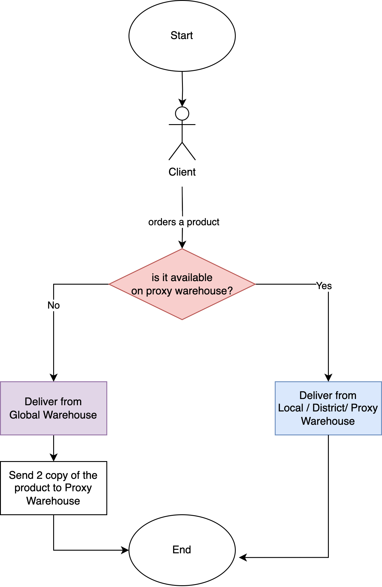
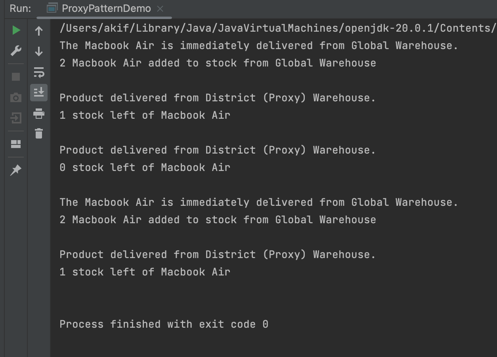

# A demonstration of Proxy Pattern

# Course Title : Object Oriented Design and Design Patterns Lab(CSE 4122)
## Author
Akif Islam<br>
Department of CSE, University of Rajshahi<br>
iamakifislam@gmail.com<br><br><br>

## Experiment 05
<p>Write a Java program to demonstrate the implementation of a proxy pattern for an online retail store with global distribution and warehousing.</p>

## Story of the Program
<p>
 This is a demonstration of Proxy Pattern.
    When a client orders a product, first it will be searched on the local/district/proxy warehouse.
    If the product exists there, it will be served from proxy warehouse.<br><br>
    Otherwise, the product will be delivered from global warehouse.
    Besides, 2 new copy of the same product will be delivered to proxy warehouse for further use.
</p>

## Flowchart 
<center>

</center>

## How to Run?
```bash
  $javac ProxyPatternDemo.java
  $java ProxyPatternDemo
```


## Proxy Pattern Demo Program
```java

DistrictProxyWarehouse districtwarehouse = new DistrictProxyWarehouse();

// 1st Order of Macbook Air - Delivered from Global Warehouse
// 2 copy of Macbook Air sent to Proxy Warehouse considering that people may buy it in future again.
districtwarehouse.deliverProduct("Macbook Air");

// 2nd Order of Macbook Air - Delivered from Proxy Warehouse
districtwarehouse.deliverProduct("Macbook Air");

// 3rd Order of Macbook Air - Delivered from Proxy Warehouse.
// No more Macbook Air available on Proxy Warehouse.
districtwarehouse.deliverProduct("Macbook Air");

// 4th Order of Macbook Air - Delivered from Global Warehouse.
// 2 copy of Macbook Air sent to Proxy Warehouse considering that people may buy it in future again.
districtwarehouse.deliverProduct("Macbook Air");

// 5th Order of Macbook Air - Delivered from Proxy Warehouse
districtwarehouse.deliverProduct("Macbook Air");

```

## Output
<center>


</center>